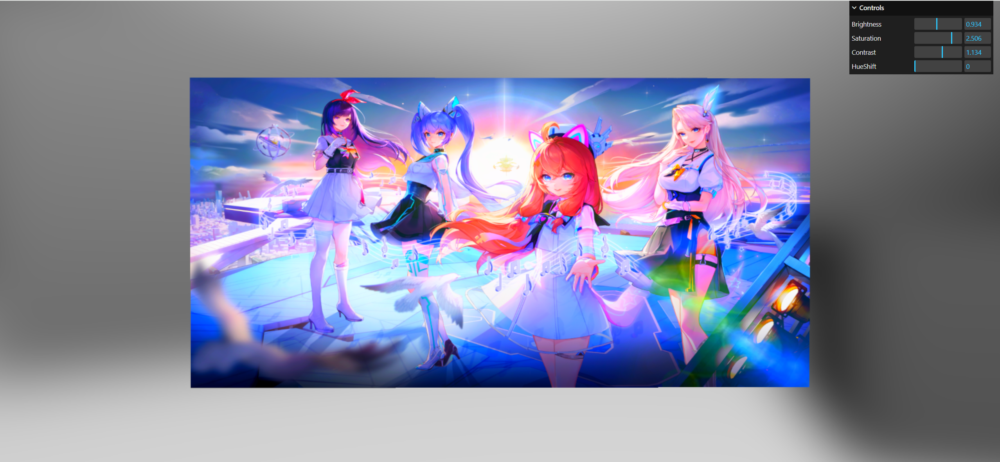
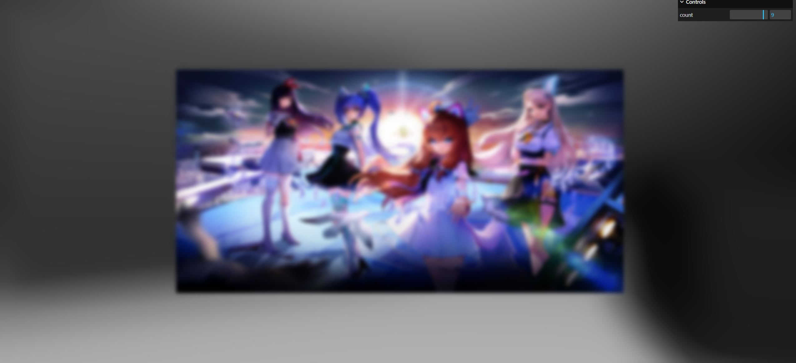
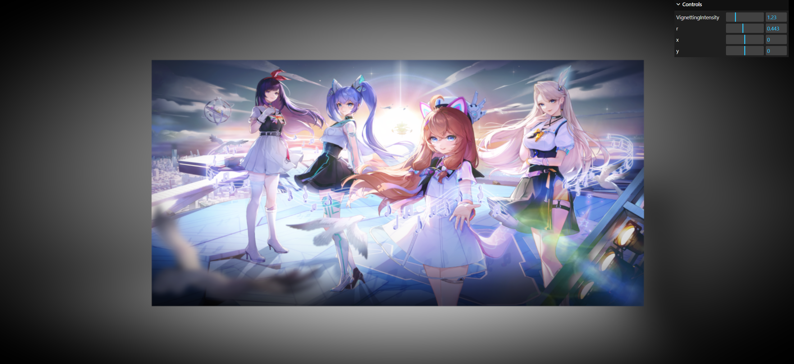
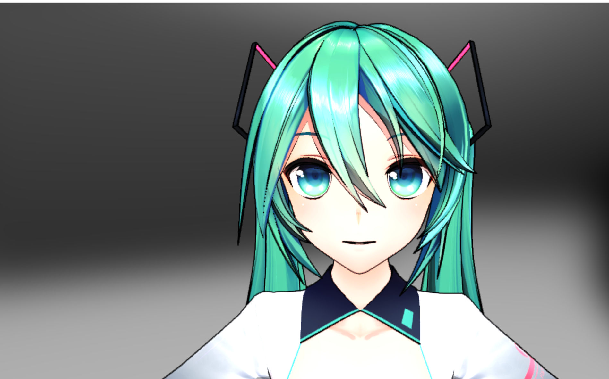
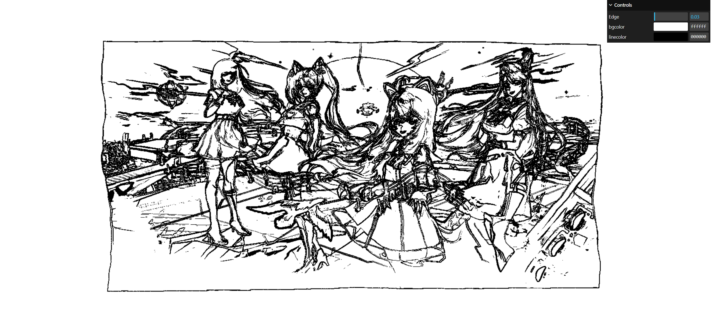

# postprocessing

a repository for postprocessing effects

post-rgba

post-vague

post-gs-vague

post-vignetting

post-outline

something todo ......

post-Pencil Effect

post-bloom

screenshot in other project

